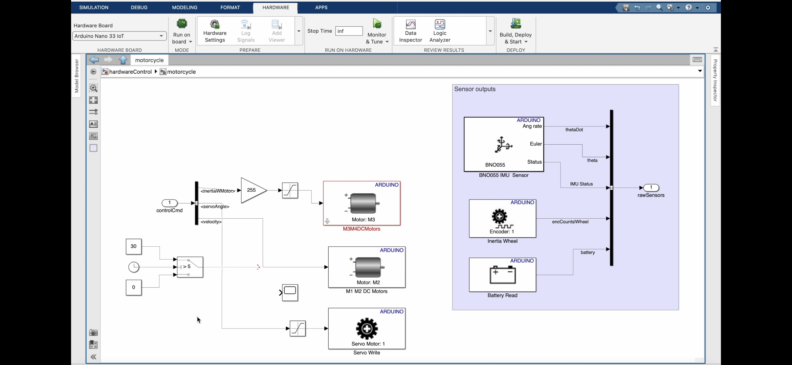
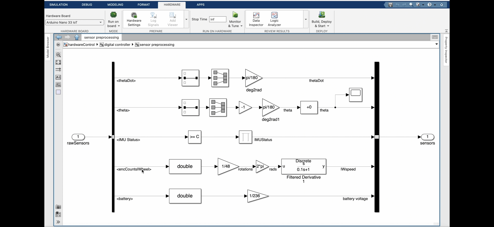

# 🚲 Self-Balancing Bicycle Project: Simulation, Design & Control

This project was a deep-dive into electromechanical system design and simulation using **Simulink** and **MATLAB**, focused on developing a controller for a self-balancing Arduino Engineering Kit Bicycle. The drivetrain was powered by a **GM12-N20VA-08225-100-EN DC motor** and tested against realistic motion profiles and dynamic forces.

The key objectives of the project included:
- Designing and tuning a **motor controller** using Simulink
- Simulating the drivetrain to verify motion behavior
- Integrating real-world specs from the geared DC motor and belt system
- Demonstrating realistic bike movement and balance via simulation and physical prototypes

---

## 🔧 Project Overview

The drivetrain system used a **timing belt and pulley train** driven by a single DC motor. Control and simulation were implemented in **MATLAB Simulink**, with a digital controller regulating motor speed and torque to maintain balance and propulsion.

This repository includes:
- Simulink model files for simulation and control
- System parameters and motor specs
- Screenshots and GIFs of simulation and real-world tests

---

## System Breakdown

### DC Motor + Gearbox
- Motor: GM12-N20VA-08225-100-EN
- Gear Ratio: 100:1
- Nominal Voltage: 6V
- No-load Speed: ~225 RPM
- Torque: Sufficient to drive rear wheel through belt-pulley


### Rear Drivetrain
- Pulley system simulates rear-wheel motion
- Timing belt modeled as rigid transmission in Simulink
- Rear inertia included in system parameters



---

## Simulink Control Design

The simulation model was created in layers:
1. **Motor block** based on provided specs
2. **Belt and pulley subsystem**
3. **Torque to motion conversion**
4. **Closed-loop speed controller** using a PID


The PID controller was tuned through trial and error using simulation sweeps to match the performance requirements. This involved tuning gain values to get a stable rise time and minimal overshoot.



---

## Testing & Results

### Calibration Challenges
- One of the biggest hurdles was converting real motor specs into usable simulation parameters.
- Small changes in gear ratio or load inertia affected the stability of the system.
- Significant time was spent tuning control logic to avoid over-oscillation or sluggish response.

### Runtime Issues
- Due to the system's complexity, simulation runtimes were long.
- Optimization was required in block execution settings and solver configurations.
- A fixed-step solver with adjusted tolerances was chosen for balance between speed and accuracy.


### Physical Test & Demonstration

- The final result was a working Simulink controller that could be implemented on the Arduino-based hardware.
- Video tests show the bike:
  - Maintaining balance
  - Moving forward in straight lines
  - Withstanding light impact or object collisions


---

## Repository Structure
```
📁 Bike-Drivetrain-Controller
├── SimulinkModels/
│   ├── bike_rear_motor.slx
│   ├── PID_controller.slx
│   └── belt_pulley_subsystem.slx
├── Images/
│   ├── drivetrain_diagram.png
│   ├── simulink_model.png
│   └── demo_gif_1.gif
├── README.md
└── Report.pdf (optional)
```

---

## How to Run
1. Open `bike_rear_motor.mlproj` in MATLAB
2. Navigate to the Simulink model `bike_rear_motor.slx`
3. Run the simulation and observe outputs in the scope blocks
4. Use the PID Tuner to adjust controller response if needed

---

## Credits
This work was completed as part of the **Mechatronics Module 5CCE2MCT** at **King's College London**, using hardware and software provided by the **Arduino Engineering Kit Rev2**.

Model files were provided and extended from base Simulink examples distributed with the kit.
